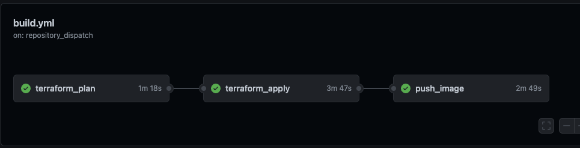
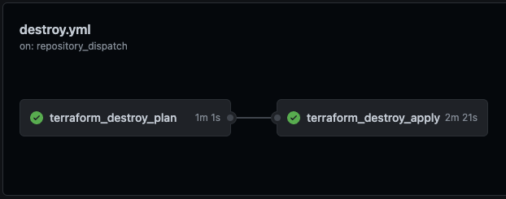
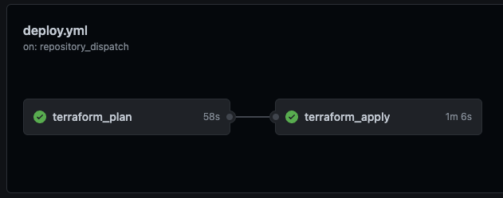
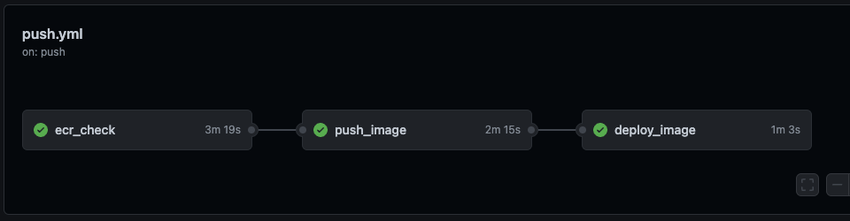
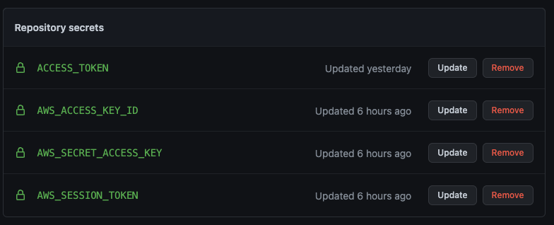

# William Chrisp Pathways Dojo Infra Node Weather App

This repository is used in conjunction with the Contino Infra Engineer to Cloud Engineer Pathway course delivered in Contini-U. It is the application half of the weather app and the main infrastructure half is located in the following repository. 
https://github.com/williamchrisp/dojo-weather-infra

It includes and supports the following functionality:
* Dockerfile and docker-compose configuration for 3M based deployments
* Makefile providing Terraform deployment functionality
* GitHub workflows for supporting Terraform deploy and destroy functionality

<br> 

## Running Locally

The provided `makefile`, `dockerfile` , and `docker-compose.yml` files work together to create a docker container which is used to run Terraform deployments and other supported commands. It expects AWS account credentials to be passed as environment variables.

Please ensure the following variables are exported locally.
If you are not using temporary credentials you do not require AWS_SESSION_TOKEN
```
export AWS_ACCESS_KEY_ID=
export AWS_SECRET_ACCESS_KEY=
export AWS_SESSION_TOKEN=
```

You can use the following commands

### Terraform
Terraform `init`, `validate` and `fmt` are run for each of the `make` commands below.

Deploying Terraform environment locally - creates tfplan file during plan as input to apply. Apply is auto-approved.

```
make run_plan
make run_apply
```

Destroying Terraform environment locally. Destroy plan is speculative. Destroy apply is auto-approved.

```
make run_destroy_plan
make run_destroy_apply
```

### Application

Building the app docker image and running locally on your machine.

```
make run_app
```

Pushing the app to ECR specified in the terraform file. `Requires the terraform stack to be deployed (make run_plan and make run_apply)`
```
make push_app
```

Deploying the new image to the ECR task. Other words, making it live! `Requires the terraform stack to be deployed (make run_plan and make run_apply)`
```
make deploy_image
```

This is based off 3 Musketeers, for more information on 3 Musketeers deployment method, visit the official site here. https://3musketeers.io/

<br> 

## GitHub Actions / Workflows
The following workflows are provided in this repository. These are located under `.github/workflows`.

| Workflow | Description | Environments | Trigger
|----------|-------------|--------------|--------|
| build.yml | This workflow will build the app from scratch using the make commands `terraform_plan, terraform_apply, push_app.` | approval | [workflow_dispatch](https://docs.github.com/en/actions/managing-workflow-runs/manually-running-a-workflow)  |
| destroy.yml | This workflow will destroy the app using the make commands `terraform_destroy_plan, terraform_destroy_apply.`| approval | [workflow_dispatch](https://docs.github.com/en/actions/managing-workflow-runs/manually-running-a-workflow) or merge with `destroy` branch|
| deploy.yml | This workflow will update the app terraform stack using the make commands `terraform_plan, terraform_apply`| approval | on push |
| push.yml | This workflow will update the app docker using the make commands `push_app, deploy_image`| approval | on push |


Note: Pushing to `master` branch will trigger workflow dependent on paths.

### deploy.yml
```
    paths:
      - 'modules/**'
      - '**.tf'
```

### push.yml
```
    paths:
      - 'application/**'
      - 'modules/ecr/**'
      - 'docker-compose.yml'
```

<br>

### build.yml workflow


### destroy.yml workflow


### deploy.yml workflow


### push.yml workflow


<br>

Pushing to master is not permitted and the current workflow is to create a branch and make a pull request with the new feature you want to add. Once this is approved and merged this will trigger the app's repositories deploy workflow.

<br> 

## GitHub Secrets
The following github secrets are required
AWS_ACCESS_KEY_ID
AWS_SECRET_ACCESS_KEY
AWS_SESSION_TOKEN
ACCESS_TOKEN
The Access token is required for action to track the status of other actions. You can follow this to create your own.
https://docs.github.com/en/authentication/keeping-your-account-and-data-secure/creating-a-personal-access-token



<br>

## Terraform IaC
The Terraform environment is includes the following `providers.tf`, `meta.tf`, `variables.tf` and `main.tf` which leverages the `.tf` modules created in `modules/`. 

The `modules` folder organises the `.tf` files called by `main.tf`.

<br>
The following Inputs are located in the variables.tf file under the root folder. Adjusting the default values allows you edit the outcome of the terraform file. These will not be used unless you are deploying this stack locally or by itself.

### Inputs
---
<details open>
  <summary>Click to expand</summary>

| Name | Description | Type | Default | Required |
|------|-------------|:----:|:-----:|:-----:|
| vpc_cidr | Specifies the cidr for the vpc | string | `"10.0.0.0/24"` | yes |
| subnet_availability_zones | Availability Zones in which each subnet will lie. Order specifies subnet. | list(any) | `"us-east-1a", "us-east-1b", "us-east-1c"` | yes |
| public_subnets | Specifies the public subnets in a list | list(any) | `"10.0.0.0/28", "10.0.0.16/28", "10.0.0.32/28"` | yes |
| private_subnets | Specifies the private subnets in a list | list(any) | `"10.0.0.64/26", "10.0.0.128/26", "10.0.0.192/26"` | yes |
| bucket | S3 bucket name - must be globally unique | string | `"williamdojoapp"` | yes |
| ecs_avalability_zones | Availability zones you want the app deployed too. | map(string) | `["us-east-1a", "us-east-1b"]`| yes |
| image_tag | Sets the image tag you would like to use. | string | `latest` | yes |
| desired_count | Number of instances of the task definition to place and keep running.| number | `1` | yes |
| deployment_max | Upper limit (as a percentage of the service's desiredCount) of the number of running tasks that can be running in a service during a deployment. | number | `200` | yes |
| deployment_min | Lower limit (as a percentage of the service's desiredCount) of the number of running tasks that must remain running and healthy in a service during a deployment. | number | `100` | yes |
| container_port | The exposed port on the container. | number |`3000` | yes |
| health_check_delay | Seconds to ignore failing load balancer health checks on newly instantiated tasks to prevent premature shutdown. | number | `60` | yes |
| cpu | The required CPU units for the container | number | `256` | yes |
| memory |  The required memory count for the container | number | `512` | yes |
| tags | Tags to be applied to AWS resources| map(string) | `Owner = "williamchrisp", Project = "node-weather-app"` | yes |
</details>

<br> 

<!-- OUTPUTS -->
### Outputs
---
<details open>
  <summary>Click to expand</summary>

| Name | Description |
|------|-------------|
| region_name | Current AWS Region |
| ecr_name | Container repository name |
| ecs_cluster | ECS Cluster Name |
| ecs_service | ECS Service Name |
| alb_url | Application Load Balancer URL |
| vpc_id | VPC id required for applications using this module |
| subnet_availability_zones | Availability Zones in which each subnet will lie. Order specifies subnet. |
| public_subnets | Specifies the public subnets in a list. Order specifies AZ |
| private_subnets | Specifies the private subnets in a list. Order specifies AZ |

</details>

<br>

### TF State Files
AWS S3 is used to host the TF state files. This is hosted by s3://pathways-dojo, you can change this to whatever pre-created bucket. You will need to update the name of the state file in the `meta.tf` file replacing `williamchrisp` with your username.

```
terraform {
  required_version = ">= 0.13.0"
  backend "s3" {
    bucket = "pathways-dojo"
    key    = williamchrisp-tfstate-app
    region = "us-east-1"
  }
}
```

## Node Weather App

The simple weather forecast application using Node.js.
Link: https://github.com/phattp/nodejs-weather-app

### Getting Started

This repository is contain code of my weather forecast application that you can predict the weather from a location.
This project is the part of [The Complete Node.js Developer Course](https://www.udemy.com/the-complete-nodejs-developer-course-2/) by Andrew Mead on Udemy.

Visit [Live Site](https://phatt-weather-app.herokuapp.com/)

### Installing

Install node modules.

```
npm install
```

### Running the App

Run this app in devlopment mode with command below and navigate to http://localhost:3000 to see the app.

```
npm run dev
```

Happy Hacking!